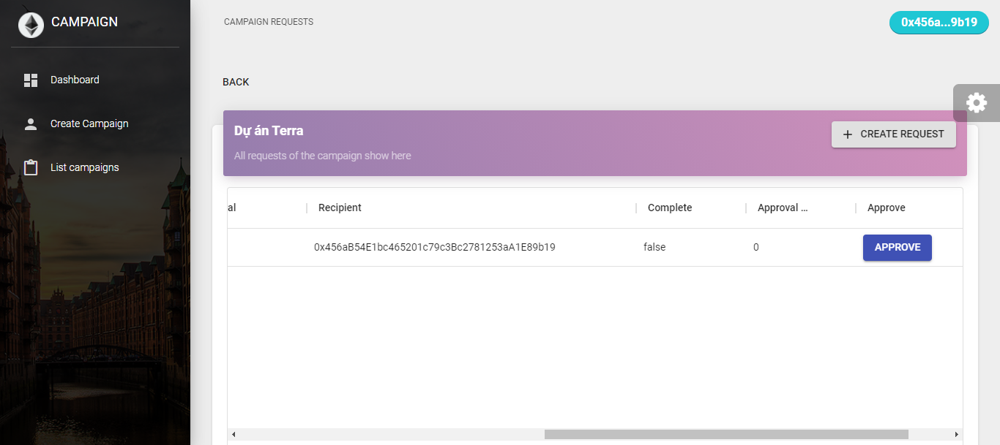

# CROWN FUNDING (DANHOM-CNM)
*Trusted Crowdfunding Platform Using a Smart Contract*

<br/>

## **Why did we create it?**

 - As per trusted reports, 85% of startups delay the delivery, and 14% don’t deliver at all what was promised to the angel investors. As of today, crowdfunding platforms have accountability and trust problems. In many cases, money from investors has gone into wrong campaigns and has been misused.
 <br/>

 - Implementing a blockchain-based platform can bring in a change. With blockchain technology, investors can know to whom the money is going and how they are spending it. A smart contract helps to block the funds within blockchain until the project or startup founder makes progress in the project.

## **How to use**

1. ### *Create an account metamask*
    1. Install **Metamask** as Google Chrome Extension
    2. Create an account.
2. ### *Get the ethereum test* 
    1. Go to https://faucet.rinkeby.io/?fbclid=IwAR0cRnpQK33X6jjW8SpmRLK_DZtuE45F0aG-iRyCk9BCOf0N5h-Z8848vXk
    2. Request Ether by sharing your ethereum address in social media ``` Twitter ``` or ```Facebook```
3. ### **`USE IN THE WEB`**
    1. Connect to metamask (click top right button) 
    
        <br/><br/>
        Metamask open

        

        Enter your password and dashboard show
        
    2. Create a campaign
       

       Fill full information and click create
       

        See list campaigns
        
    3. Contribute

        Choose the campaign that you like, input ethereum value then click Contribute
       
    4. Create requests

        Click `ALL REQUESTS` in the campaign page and click `CREATE REQUEST` in  Campaign requests page.

        Fill all information then click `CREATE REQUEST`
       
    5. Approve requests

       Click `ALL REQUESTS` in the campaign page.

       All requests will be display here.

       If you are a contributor, the button *Approve* will be shown.
       

       Request is approved.
       

***
## **Run local**

1. Clone the repository
2. Using npm i or yarn install
3. ```npm run dev``` to start

***
## **Improve**

You need to learn **Solidity** to improve this project